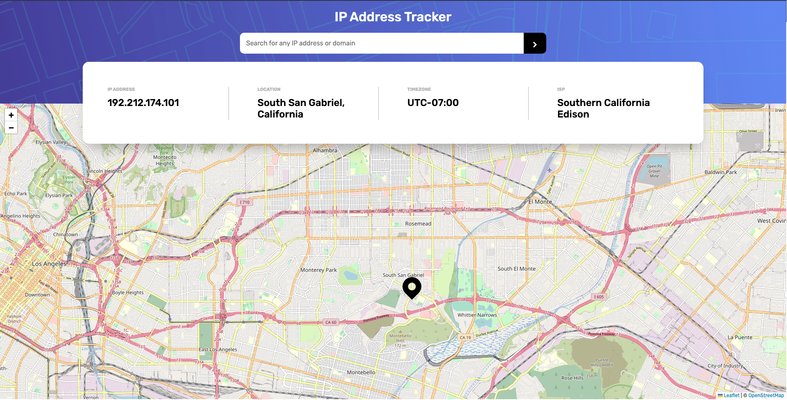

# Frontend Mentor - IP address tracker solution

This is a solution to the [IP address tracker challenge on Frontend Mentor](https://www.frontendmentor.io/challenges/ip-address-tracker-I8-0yYAH0). Frontend Mentor challenges help you improve your coding skills by building realistic projects.

## Table of contents

- [Overview](#overview)
  - [The challenge](#the-challenge)
  - [Screenshot](#screenshot)
  - [Links](#links)
  - [Built with](#built-with)
  - [What I learned](#what-i-learned)
  - [Useful resources](#useful-resources)
- [Author](#author)

## Overview

Your challenge is to build out this IP Address Tracker app and get it looking as close to the design as possible. To get the IP Address locations, you'll be using the IP Geolocation API by IPify. To generate the map, we recommend using LeafletJS.

You can use any tools you like to help you complete the challenge. So if you've got something you'd like to practice, feel free to give it a go.

### The challenge

Users should be able to:

- View the optimal layout for each page depending on their device's screen size
- See hover states for all interactive elements on the page
- See their own IP address on the map on the initial page load
- Search for any IP addresses or domains and see the key information and location

### Screenshot



### Links

- Solution URL: [Add solution URL here](https://your-solution-url.com)
- Live Site URL: [Add live site URL here](https://ip-address-tracker-master-rho.vercel.app/)

### Built with

- Semantic HTML5 markup
- CSS custom properties
- CSS Grid
- vanilla JS

### What I learned

its the first time learning about api in a big capacity. so basically i learned how to create promises with the fetch api. the whole process ws new to me and is a great experience. I also learn't about minmax()
when working with grid layout in css. helped me isolate section i want to be more responsive.

code snippets, see below:

```css
.grid {
  display grid;
  grid-template-row: 1fr minmax(200px, auto) 1fr;
}
```

```js
fetch("http://api.example")
  .then((response) => {
    if (response.status >= 200 && response.status <= 299) {
      return response.json();
    } else {
      throw Error(response.statusText);
    }
  })
  .then((data) => {
    //Do something
  })
  .catch(() => {
    return error;
  });
```

If you want more help with writing markdown, we'd recommend checking out [The Markdown Guide](https://www.markdownguide.org/) to learn more.

### Useful resources

- [Example resource 1](https://www.youtube.com/c/WebDevSimplified) - taught me minmax() grid layout css
- [Example resource 2](https://www.youtube.com/c/AniaKub%C3%B3w) - taught me about api's in terms of promises and async await - how they work.

## Author

- Frontend Mentor - [@XODesigns](https://www.frontendmentor.io/profile/XODesigns)
